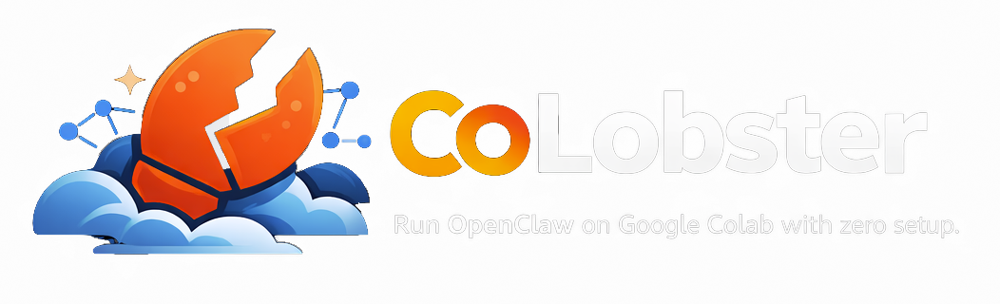

  

  

## What is this?

**CoLobster** is a ready-to-run Colab notebook that launches the full [OpenClaw](https://openclaw.ai) AI gateway on a free CPU instance. No local install, no server, no Docker — just a browser.

**OpenClaw** is an open-source personal AI assistant gateway. It connects to LLM providers (Gemini, Claude, GPT, OpenRouter) and gives you a unified chat interface, with optional connections to WhatsApp, Telegram, Slack, and more. For full docs, see the [OpenClaw repo](https://github.com/openclaw/openclaw).

## How it works

1. **Add an API key** — paste a provider key (Gemini is free) into Colab's Secrets panel
2. **Install & configure** — one click installs Node.js + OpenClaw and detects your keys
3. **Launch** — one click starts the gateway and picks the best model for your keys

Then chat directly in the notebook via the built-in Gradio UI, or create a public URL with ngrok to connect messaging channels or access from other devices.

## Features

- **Zero setup** — runs entirely in Colab, nothing to install locally
- **Free tier friendly** — works with a free Gemini API key
- **Auto model selection** — OpenClaw picks the best model from your available API keys
- **Built-in chat UI** — Gradio interface right in the notebook
- **Optional persistence** — mount Google Drive to keep conversations across sessions
- **Optional public URL** — ngrok tunnel for external access and messaging channel integration

## Getting started

Click the badge above or go directly to the notebook:

**[Open CoLobster in Google Colab](https://colab.research.google.com/github/wandrzej/colobster/blob/HEAD/colobster.ipynb)**

## Links

- [OpenClaw](https://github.com/openclaw/openclaw) — the upstream project (full docs, channels, self-hosting)
- [OpenClaw Docs](https://docs.openclaw.ai) — configuration, models, messaging channels
- [OpenClaw Discord](https://discord.gg/clawd) — community support

## License

MIT — same as [OpenClaw](https://github.com/openclaw/openclaw/blob/main/LICENSE).
